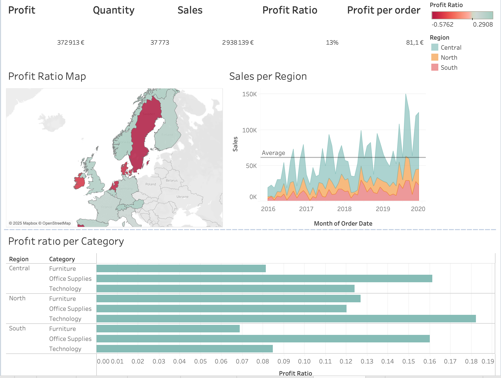
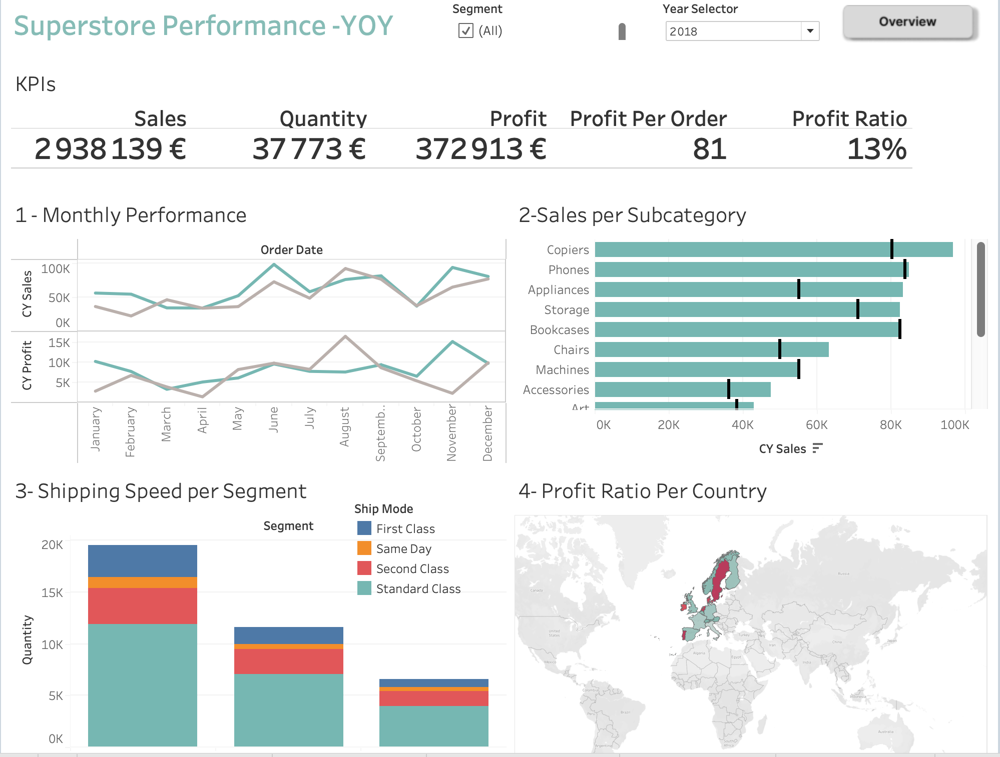

# 📊 Superstore Sales Performance Dashboard – Tableau

This project features a KPI-focused dashboard created with Tableau. It analyzes sales performance, shipping speed, and profit distribution by category, country, and region.

## 🖼️ Dashboard Preview

  

## 🔍 What's Included
- **KPI Panel**: Total Sales, Quantity, Profit, Profit Ratio, Profit per Order
- **Monthly Trends**: Year-over-year analysis of sales and profit
- **Subcategory Breakdown**: Best and worst performing product types
- **Shipping Speed**: Segment analysis based on shipping method
- **Profitability Map**: Profit ratios per European country

## 📁 Files
- `sales_performance.twb`: Tableau workbook
- `Screenshot_1.png` and `Screenshot_2.png`: Visual previews of the dashboard

## 🛠️ Tools Used
- Tableau
- Mapbox (for geographical data visualization)

## 👩‍💻 Author
Saadet Doga Hascelik – Digital Marketing & Data Science Student @ Emlyon Business School
